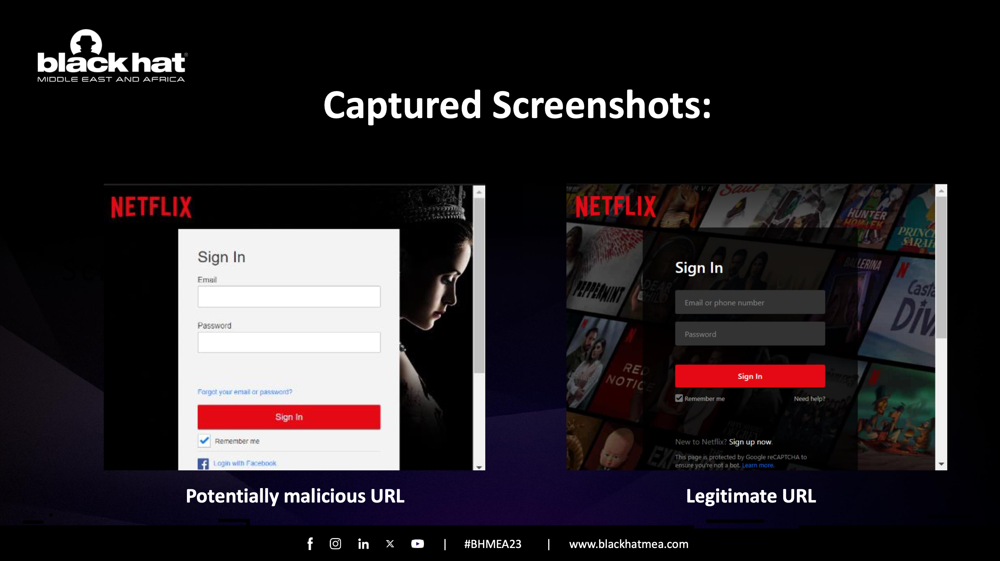
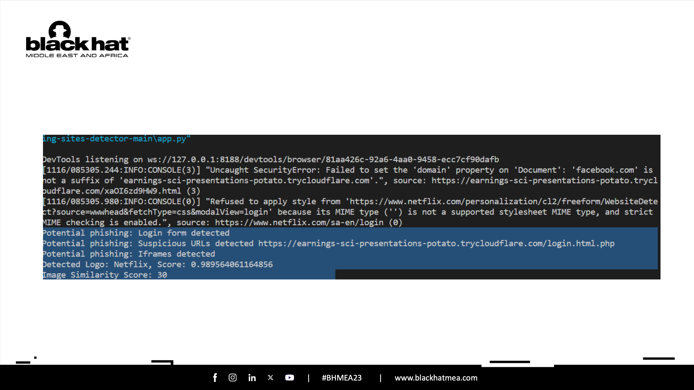

# Cipher-BOT: Validation of Phishing Sites Using AI 

## Overview

This repository contains a Python script that automates the process of validating phishing sites. It utilizes various technologies and APIs to capture screenshots, perform logo detection, analyze content, and compare images for similarity. The script is designed to aid in the identification of potential phishing sites, making the validation process more efficient.

## Cipher-BOT: How it works? 
1. The script uses the URL string or web page content as an input.
2. Cipher-BOT extracts features and compares them with many anchors of the
    original web page, such as domain, favicon, copyright, title, text similarity, and
    more, to identify the impersonation.
3. Cipher-BOT uses AI Vision and compares the two images and makes a decision.

## Cipher-BOT: Sample Run 

### Screenshots of URLs 


### Cipher-BOT Report 


### Report Explanation

#### Confidence Scores : GCP VisionAI
- **_‘Logo.score’_** represents the confidence score for the detected logo. The score is a float value ranging from `0.0` to `1.0`, where `1.0` indicates high confidence.
- Adjusting the threshold for logo detection confidence scores involves setting a minimum score that a detected logo must meet to be considered valid or reliable. The specific threshold you choose depends on the characteristics of your images and your application's requirements.
  
#### Confidence Scores : DeepAI
- The similarity score is accessed using **_‘similarity_result['output']['distance']’_**
- Typically, a lower distance value indicates higher similarity, while a higher distance value indicates lower similarity. This also can be set a certain threshold based on the sensitivity of your application.

## Instructions

Follow these steps to use the code:

1. Clone the repository to your local machine:

    ```bash
    https://github.com/rreemalfaleh/CipherBot-Phishing-Sites-Validation.git
    ```

2. Install the required dependencies:

    ```bash
    pip install -r requirements.txt
    ```

3. Set up a service account key for [Google Cloud Vision API](https://cloud.google.com/vision?hl=en) and replace the placeholder in `YOUR-PATH\KEY.json` with the actual path to your key file.

4. Obtain an API key from [DeepAI](https://deepai.org/machine-learning-model/image-similarity) and replace the placeholder `'YOUR API KEY'` in `app.py` with your actual API key.

5. **Download ChromeDriver:**
    - ChromeDriver is not a Python package and needs to be downloaded separately.
    - Visit the [ChromeDriver download page](hhttps://chromedriver.chromium.org/) and download the appropriate version for your operating system.
    - Extract the downloaded archive and ensure the `chromedriver` executable is available in your system's PATH.

6. **Update the sample URLs in `app.py`:**
    - Locate the section with sample URLs:

        ```python
        # SAMPLE: Capture a screenshot of a malicious URL
        malicious_url = 'https://earnings-sci-presentations-potato.trycloudflare.com/login.html.php'
        capture_screenshot(malicious_url, 'malicious_screenshot.png')

        legitimate_url = 'https://www.netflix.com/sa-en/login'
        capture_screenshot(legitimate_url, 'legitimate_screenshot.png')
        ```

    - Replace the sample URLs with the URLs you want to test.

7. Run the script:

    ```bash
    python app.py
    ```

## Note

This repository was created for educational purposes and to demonstrate automated phishing site validation. It is crucial to use such tools responsibly and ethically. The script should not be used for any malicious or unethical activities.

## Disclaimer

This repository and its content were used for a presentation at Black Hat Middle East and Africa (Riyadh, KSA). The intention is solely educational, and users are responsible for adhering to ethical standards and legal regulations.


